# Cell Segmentation Toolkit

[](https://www.python.org/downloads/)
[](https://pytorch.org/)
[](https://lightning.ai/)
[](https://opensource.org/licenses/MIT)

**Comparative analysis of deep learning approaches for heterogeneous cell segmentation in histopathology images**

*Master 2 Internship Project - Institut Pasteur, Paris*

---

## 📋 Table of Contents

- [Overview](#overview)
- [Key Results](#key-results)
- [Visual Examples](#visual-examples)
- [Installation](#installation)
- [Usage](#usage)
- [Bias Analysis](#bias-analysis)
- [Project Structure](#project-structure)
- [Model Comparison](#model-comparison)
- [Citation](#citation)

---

## Overview

This toolkit provides implementations and comprehensive benchmarking of three major deep learning approaches for cell/nuclei instance segmentation:

| Model | Approach | Strengths | Best For |
|-------|----------|-----------|----------|
| **U-Net** | Semantic segmentation + watershed | Fast, high pixel-level accuracy | Isolated cells, general purpose |
| **StarDist** | Star-convex polygon detection | Accurate shapes, multi-class support | Round/oval nuclei |
| **CellPose** | Gradient field regression | Best instance separation | Touching/clustered cells |

### Dataset: PanNuke

- **19 tissue types** from various organs
- **~7,900 images** (256×256 pixels, H&E stained)
- **5 cell classes**: Neoplastic, Inflammatory, Connective, Dead, Epithelial
- **Split**: Train (5,418) / Val (1,161) / Test (1,162)

---

## Key Results

### Performance Metrics on PanNuke (Full Test Set)

| Model | Dice | IoU | F1-instance | Precision | Recall | AJI | PQ |
|-------|------|-----|-------------|-----------|--------|-----|-----|
| **U-Net** | **0.816** | **0.709** | 0.579 | 0.499 | **0.719** | 0.457 | 0.461 |
| **StarDist** | 0.710 | 0.568 | 0.626 | 0.616 | 0.657 | 0.414 | 0.451 |
| **CellPose** | 0.766 | 0.646 | **0.680** | **0.723** | 0.664 | **0.497** | **0.533** |

**Key Findings:**
- **U-Net**: Best pixel-level metrics (Dice, IoU), highest recall but lower precision
- **StarDist**: Balanced precision/recall, good for round nuclei
- **CellPose**: Best instance-level metrics (F1, AJI, PQ), highest precision

---

## Visual Examples

### Segmentation Comparison

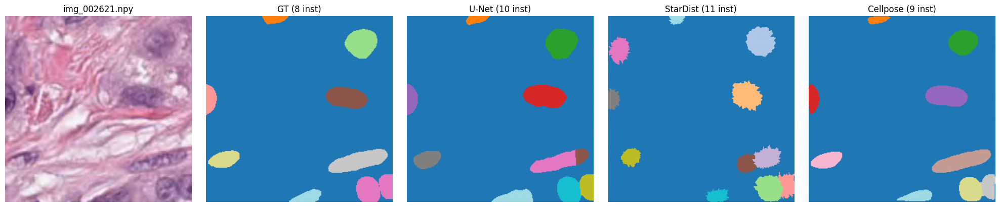

*Comparison of U-Net, StarDist, and CellPose predictions on the same image. Ground truth (GT) shown for reference.*

### More Examples

<p float="left">
  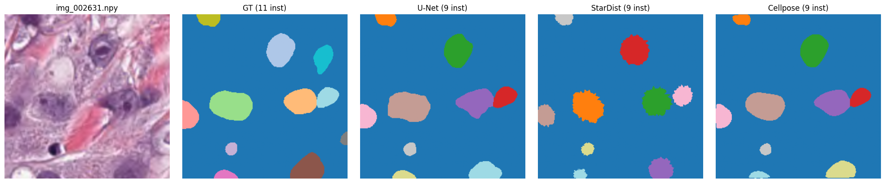
</p>

<p float="left">
  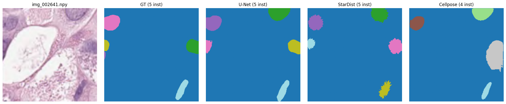
</p>

### Model Performance Comparison

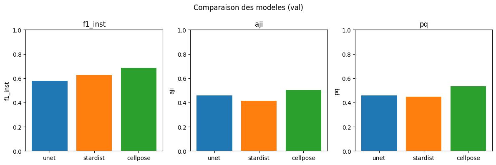

*Barplot comparing mean metrics across models on the validation set.*

### IoU Distribution by Model

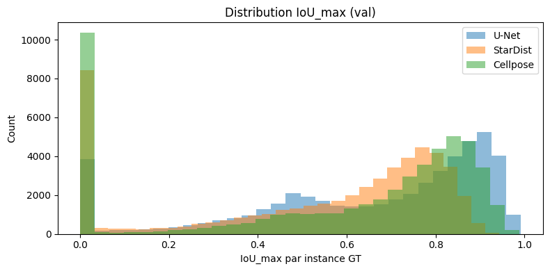

*Distribution of IoU scores shows CellPose achieves higher median IoU for matched instances.*

---

## Bias Analysis

A key contribution of this work is the systematic analysis of model biases across different cell characteristics.

### Performance by Cell Type

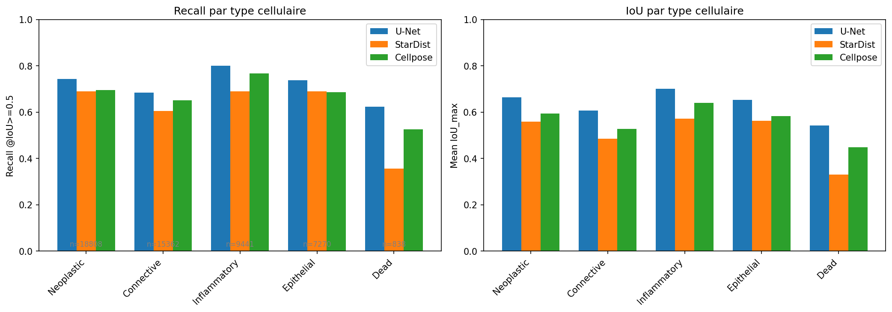

*Detection recall varies significantly by cell type. Inflammatory cells are hardest to detect across all models.*

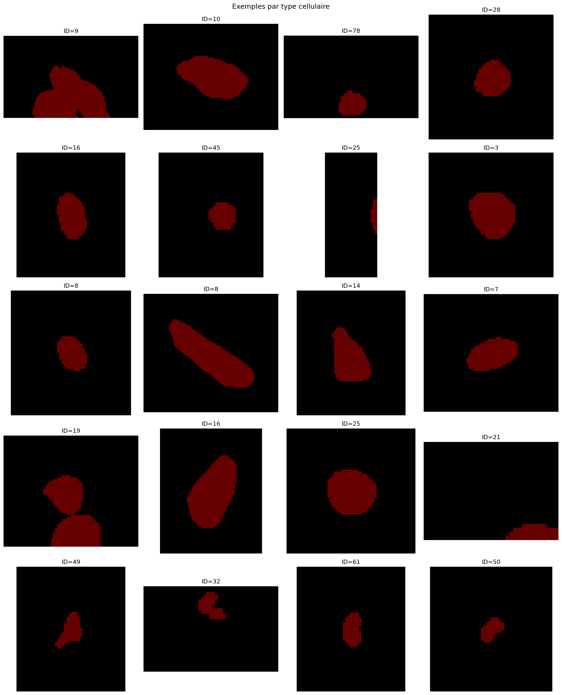

### Performance by Cell Size

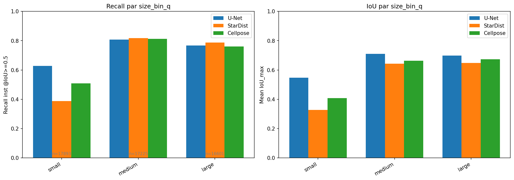

*Small cells (Q1) are harder to detect than large cells (Q4). CellPose shows the most consistent performance across sizes.*

### Performance by Morphological Class

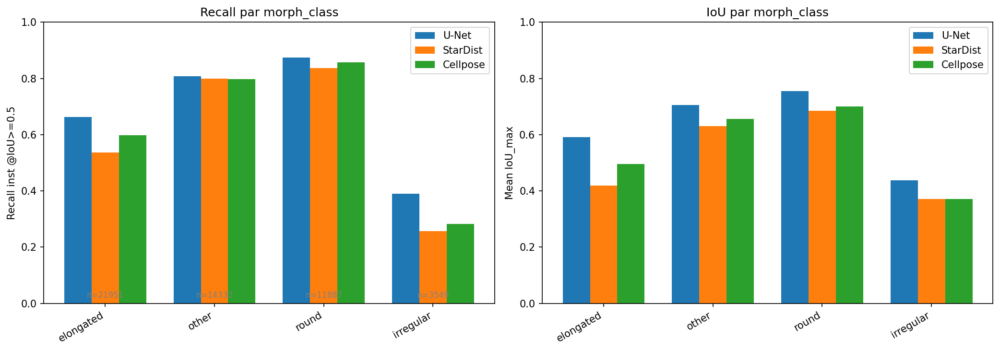

*Elongated and irregular cells are more challenging than round cells for all models.*

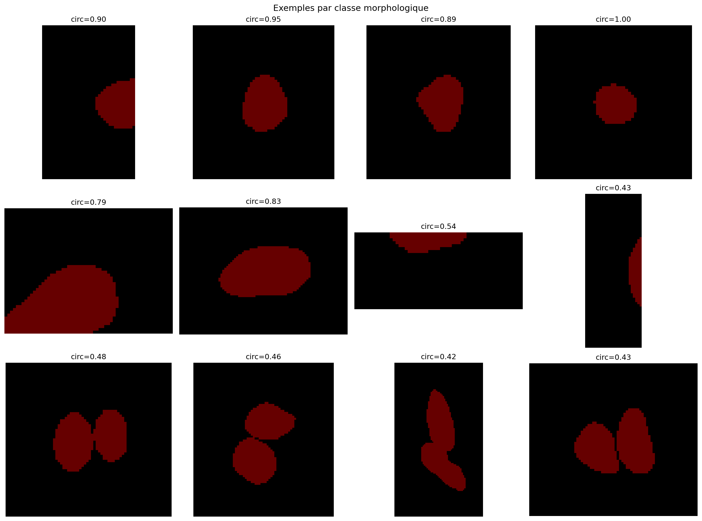

### Performance vs Cell Density

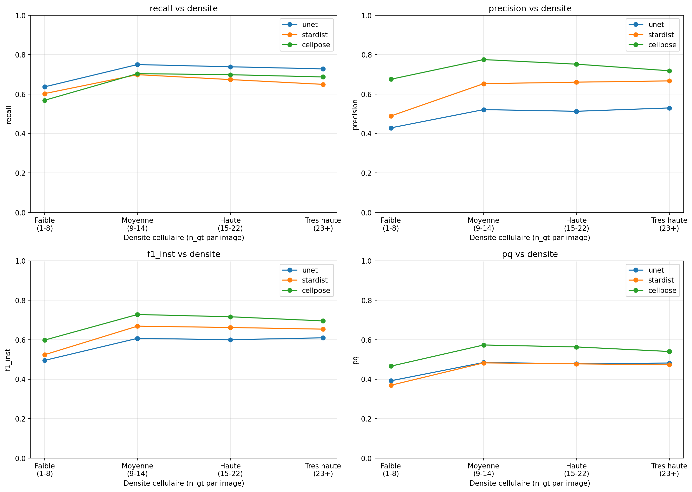

*As cell density increases, all models show decreased performance, but CellPose degrades more gracefully.*

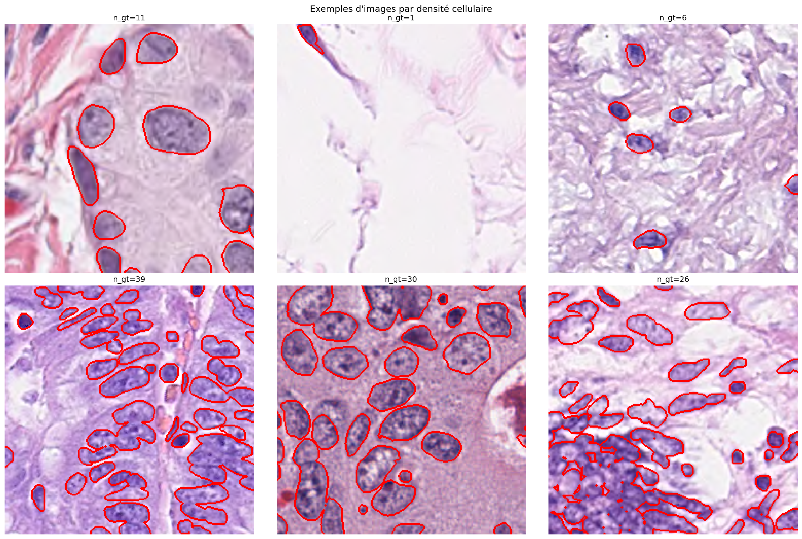

### Contact Analysis (Touching Cells)

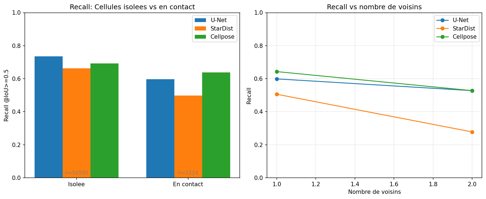

*Cells with high contact ratios (many neighbors) are harder to segment correctly.*

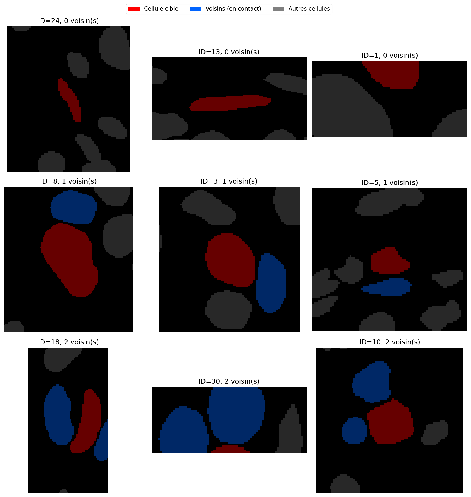

### Robustness to Noise

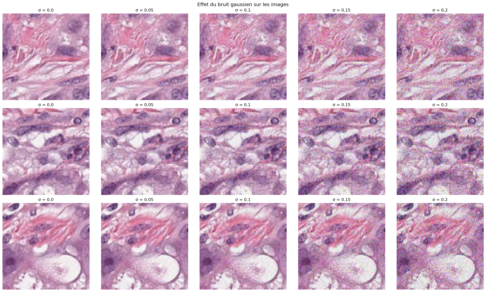

*StarDist shows the best robustness to Gaussian noise, while CellPose is most sensitive.*

---

## Installation

### Option 1: pip (Recommended)

```bash
# Clone the repository
git clone https://github.com/yehadji/cell-segmentation.git
cd cell-segmentation

# Create virtual environment
python -m venv .venv
source .venv/bin/activate  # Linux/Mac
# or: .venv\Scripts\activate  # Windows

# Install dependencies
pip install -r requirements.txt

# Optional: Install CellPose for full functionality
pip install cellpose>=3.0
```

### Option 2: Docker

```bash
# Build image
docker build -t cell-seg -f docker/Dockerfile .

# Run demo interface
docker run -p 7860:7860 cell-seg
```

---

## Usage

### 1. Demo Interface (Gradio)

```bash
python app_demo.py
# Open http://localhost:7860 in your browser
```

Features:
- Upload PNG, JPEG, TIFF, or NPY images
- Compare all three models side-by-side
- Adjust detection thresholds interactively
- Export results as 16-bit TIFF or CSV

### 2. Data Preparation

```bash
# Prepare PanNuke dataset
python src/prepare_pannuke.py --input data/pannuke --output data/prepared/pannuke

# Pre-compute StarDist targets (speeds up training)
python src/pre_compute_stardist_targets.py --data data/prepared/pannuke
```

### 3. Training

```bash
# U-Net
python models/lit_unet_pannuke.py

# StarDist
python models/lit_stardist_pannuke.py

# CellPose (fine-tuning)
python models/train_cellpose_pannuke.py
```

### 4. Inference (Python API)

```python
import torch
import numpy as np
from models.lit_unet_pannuke import UNetLightning
from models.lit_stardist_pannuke import StarDistLightning
from models.stardist import stardist_decode

# Load image (256x256 RGB, normalized to [0,1])
image = np.load("your_image.npy")  # (H, W, 3)
x = torch.from_numpy(image).permute(2, 0, 1).unsqueeze(0).float()

# ===== U-Net =====
unet = UNetLightning.load_from_checkpoint("models/checkpoints/unet_pannuke_lit_best.ckpt")
unet.eval()
with torch.no_grad():
    prob = torch.sigmoid(unet(x))[0, 0].numpy()

# ===== StarDist =====
stardist = StarDistLightning.load_from_checkpoint("models/checkpoints/stardist_pannuke_best.ckpt")
stardist.eval()
with torch.no_grad():
    prob_logits, dist_pos, class_logits = stardist(x)

prob_map = torch.sigmoid(prob_logits)[0, 0].numpy()
dist_map = dist_pos[0].numpy()
class_prob = torch.softmax(class_logits, dim=1)[0].numpy()

# Apply prob_peak correction (reduces false positives)
center = dist_map.mean(axis=0)
center = center / (center.max() + 1e-6)
prob_peak = prob_map * center

instances, classes = stardist_decode(
    prob_map=prob_peak,
    dist_map=dist_map,
    class_prob=class_prob,
    prob_thr=0.35,
    nms_iou_thr=0.3,
    use_local_maxima=True,
    local_max_footprint=11,
)

# ===== CellPose =====
from cellpose import models as cp_models
cp = cp_models.CellposeModel(gpu=torch.cuda.is_available())
masks, flows, styles = cp.eval(image, diameter=None)
```

---

## Project Structure

```
cell_segmentation/
├── models/
│   ├── unet.py                    # U-Net architecture
│   ├── stardist.py                # StarDist with Numba optimization
│   ├── lit_unet_pannuke.py        # PyTorch Lightning U-Net
│   ├── lit_stardist_pannuke.py    # PyTorch Lightning StarDist
│   ├── train_cellpose_pannuke.py  # CellPose fine-tuning
│   ├── callbacks.py               # EMA, gradient accumulation
│   └── checkpoints/               # Trained model weights
│
├── src/
│   ├── pannuke_dataset.py         # Dataset loader with augmentation
│   ├── losses.py                  # Dice, Focal, Tversky losses
│   ├── prepare_pannuke.py         # Data preparation pipeline
│   └── compute_morphology_pannuke.py  # Feature extraction
│
├── configs/                       # YAML configuration files
│   ├── default.yaml
│   ├── unet.yaml
│   ├── stardist.yaml
│   └── cellpose.yaml
│
├── figures/                       # Generated visualizations
├── docs/
│   └── guide_biologiste.md        # User guide (French)
│
├── app_demo.py                    # Gradio web interface
├── index.ipynb                    # Main analysis notebook
└── README.md
```

---

## Model Comparison

### Which Model Should I Use?

```
                    ┌─────────────────────────────┐
                    │       START HERE            │
                    └─────────────────────────────┘
                                 │
                                 ▼
                    ┌─────────────────────────────┐
                    │   Are cells touching or     │
                    │      highly clustered?      │
                    └─────────────────────────────┘
                          │              │
                         YES             NO
                          │              │
                          ▼              ▼
               ┌──────────────┐   ┌─────────────────────┐
               │  CellPose    │   │  What cell shapes?  │
               │  (best F1)   │   └─────────────────────┘
               └──────────────┘          │
                                    ┌────┴────┐
                                    │         │
                              Round/Oval   Irregular
                                    │         │
                                    ▼         ▼
                            ┌──────────┐  ┌──────────┐
                            │ StarDist │  │  U-Net   │
                            │(accurate │  │ (fast,   │
                            │ shapes)  │  │  robust) │
                            └──────────┘  └──────────┘
```

### Detailed Comparison

| Criterion | U-Net | StarDist | CellPose |
|-----------|-------|----------|----------|
| **Speed** | ⭐⭐⭐ Fast | ⭐⭐ Medium | ⭐ Slow |
| **Pixel accuracy** | ⭐⭐⭐ Best | ⭐⭐ Good | ⭐⭐ Good |
| **Instance separation** | ⭐ Basic | ⭐⭐ Good | ⭐⭐⭐ Best |
| **Touching cells** | ⭐ Poor | ⭐⭐ Good | ⭐⭐⭐ Best |
| **Multi-class** | ❌ No | ✅ Yes | ❌ No |
| **Shape accuracy** | ⭐ Watershed | ⭐⭐⭐ Polygons | ⭐⭐ Flow |

---

## Evaluation Metrics

| Metric | Description | Level | Range |
|--------|-------------|-------|-------|
| **Dice** | 2×TP / (2×TP + FP + FN) | Pixel | [0, 1] |
| **IoU** | TP / (TP + FP + FN) | Pixel | [0, 1] |
| **F1-instance** | Harmonic mean of precision & recall | Instance | [0, 1] |
| **AJI** | Aggregated Jaccard Index | Instance | [0, 1] |
| **PQ** | Panoptic Quality = SQ × RQ | Instance | [0, 1] |

---

## Configuration

Training parameters are defined in YAML files:

```yaml
# configs/stardist.yaml
model:
  n_rays: 64              # Number of radial directions
  base_ch: 32             # Base channel count
  max_dist: 80.0          # Maximum ray distance

training:
  batch_size: 4
  max_epochs: 50
  lr: 1e-4
  optimizer: AdamW
  scheduler: cosine_warmup
  warmup_epochs: 5

decode:
  prob_thr: 0.35          # Probability threshold
  nms_iou_thr: 0.3        # NMS IoU threshold
  local_max_footprint: 11 # Local maxima detection window
  use_prob_peak: true     # Apply center weighting
```

---

## Citation

If you use this work, please cite:

```bibtex
@mastersthesis{yehadji2025cellseg,
  author  = {Yehadji, Abilé Alexis-Honoré},
  title   = {Evaluation and Bias Analysis of CNN-based Deep Learning
             Approaches for Heterogeneous Cell Segmentation},
  school  = {Dakar Institute of Technology / Institut Pasteur},
  year    = {2025},
  address = {Paris, France}
}
```

---

## License

This project is licensed under the MIT License - see the [LICENSE](LICENSE) file for details.

---

## Acknowledgments

- **Institut Pasteur** - Biological Image Analysis Unit (BIA)
- **Dakar Institute of Technology**
- **Supervisors**: Éric Djiky, Tristan Manneville
- **Unit Head**: Jean-Christophe Olivo-Marin

---

## Contact

- **Author**: Yehadji Abilé Alexis-Honoré
- **Email**: alexis-honore.yehadji@pasteur.fr
- **Institution**: Institut Pasteur, Paris

---

*This project was developed as part of a Master 2 internship at Institut Pasteur (2024-2025).*
